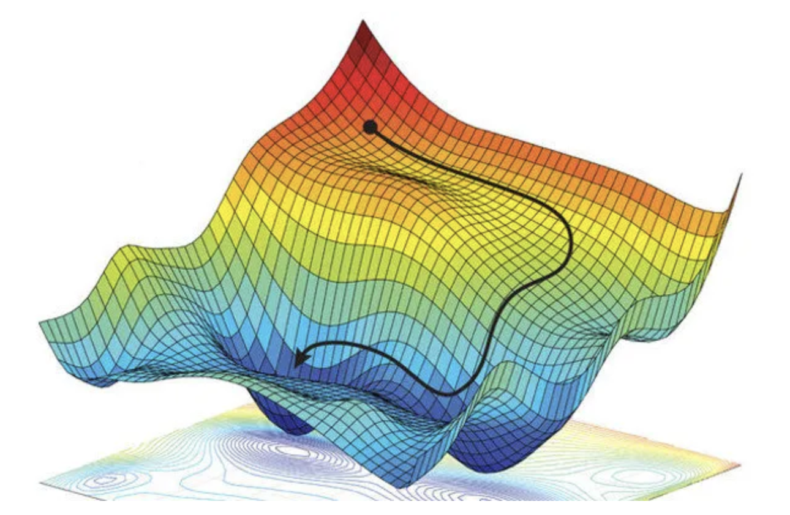

I worked on my thesis throughout my senior year under the advisement of Professor Jo Hardin.

{width=400px fig-align="center"}

This thesis explores the advantages, disadvantages, and applications of different optimization routines in the context of different surfaces, namely the
Levenberg-Marquardt Algorithm and the Whale Optimization Algorithm.
We use simulation to evaluate and compare the two algorithms in their accuracy and convergence speed. We then propose a novel algorithm, combining
the two, including modifications made to the WOA.

[Download my thesis (PDF)](files/thesis.pdf){target="_blank"}

